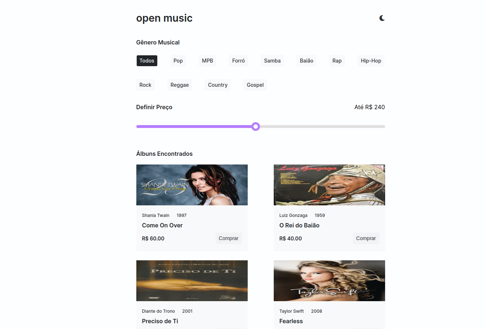
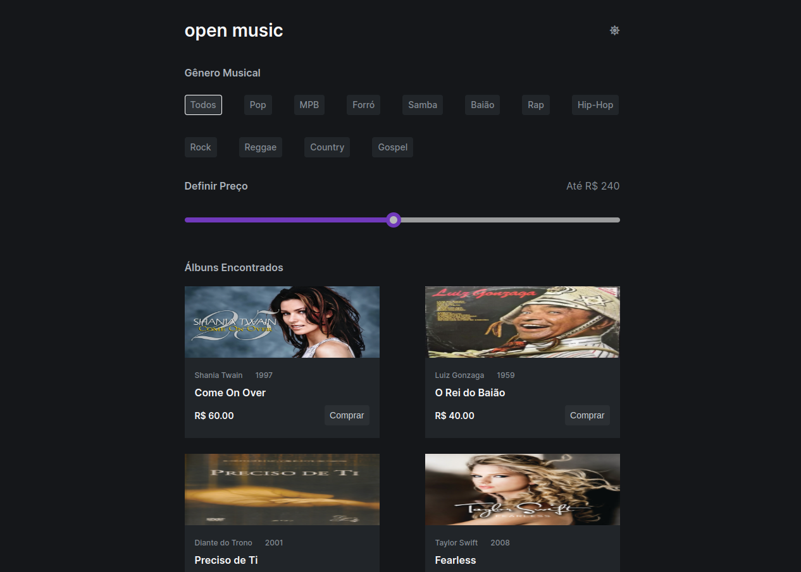

# open music

## Descrição do Projeto

Este projeto simula uma loja de discos virtual, foi utilizado um mock de dados para simular um banco de dados. É possível filtrar álbuns por categoria e preço e utilizar o tema de preferência salvo no local storage.

## Funcionalidades

1. **Filtragem por categoria**: Os usuários podem pesquisar álbuns por categoria clicando nos botões de categoria.
2. **Filtragem por preço**: Os usuários podem pesquisar álbuns por preço de acordo com o slider.
3. **Filtragem por categoria e preço**: Os usuários podem pesquisar por categoria e preço, utilizando o botão de categoria e o slider em conjunto.
4. **Tema escuro e tema claro**: Os usuários podem definir o tema de preferência, por padrão o tema claro ja é inicializado, para trocar de tema basta clicar no icone no canto superior direito.

## Tecnologias Utilizadas

- HTML
  - Tags Sêmanticas
- CSS
  - Variáveis CSS
- JavaScript
  - Manipulação de DOM
  - Local Storage
- Font Awesome
  - Ícones

## Como Executar o Projeto

1. Clone o repositório para o seu computador.
2. Abra o arquivo `index.html` no seu navegador.

## Imagem Light Mode

## Imagem Dark Mode

## Contribuições

Contribuições são sempre bem-vindas. Sinta-se à vontade para abrir uma issue ou fazer um pull request.

